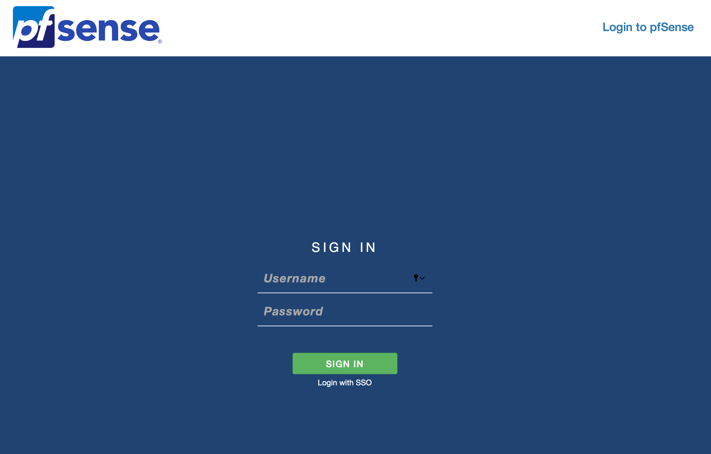
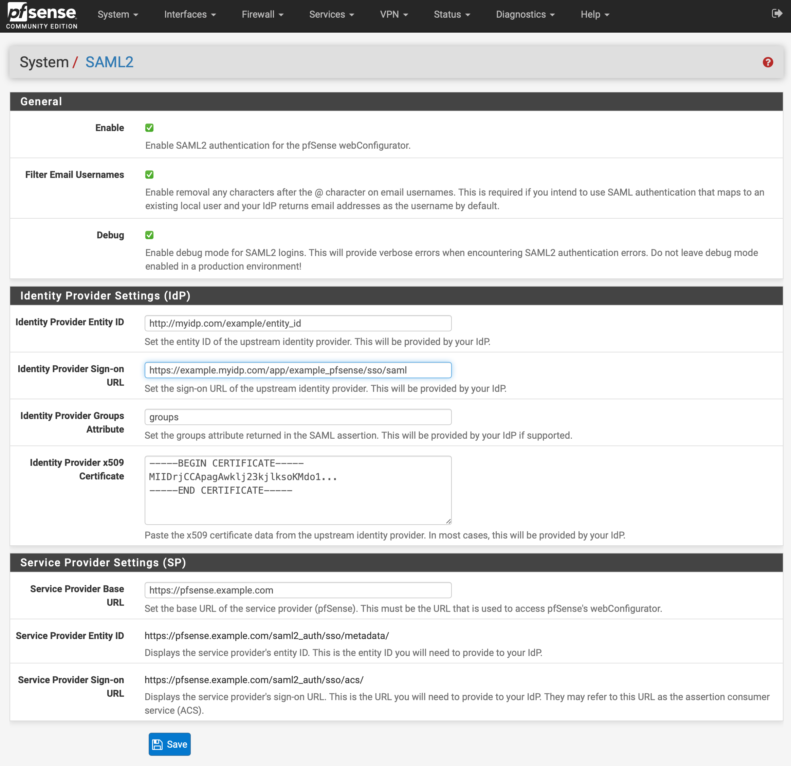
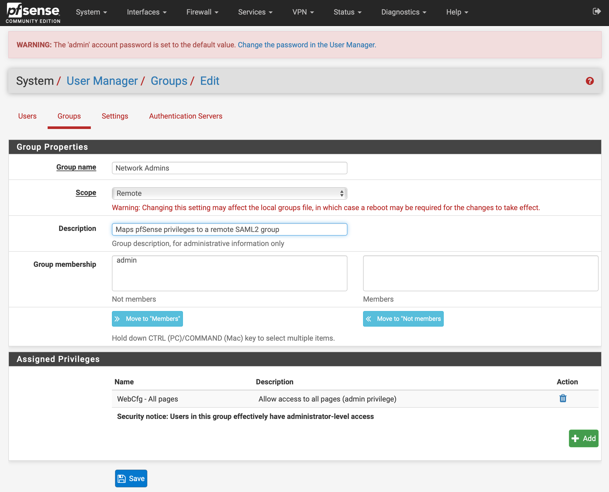
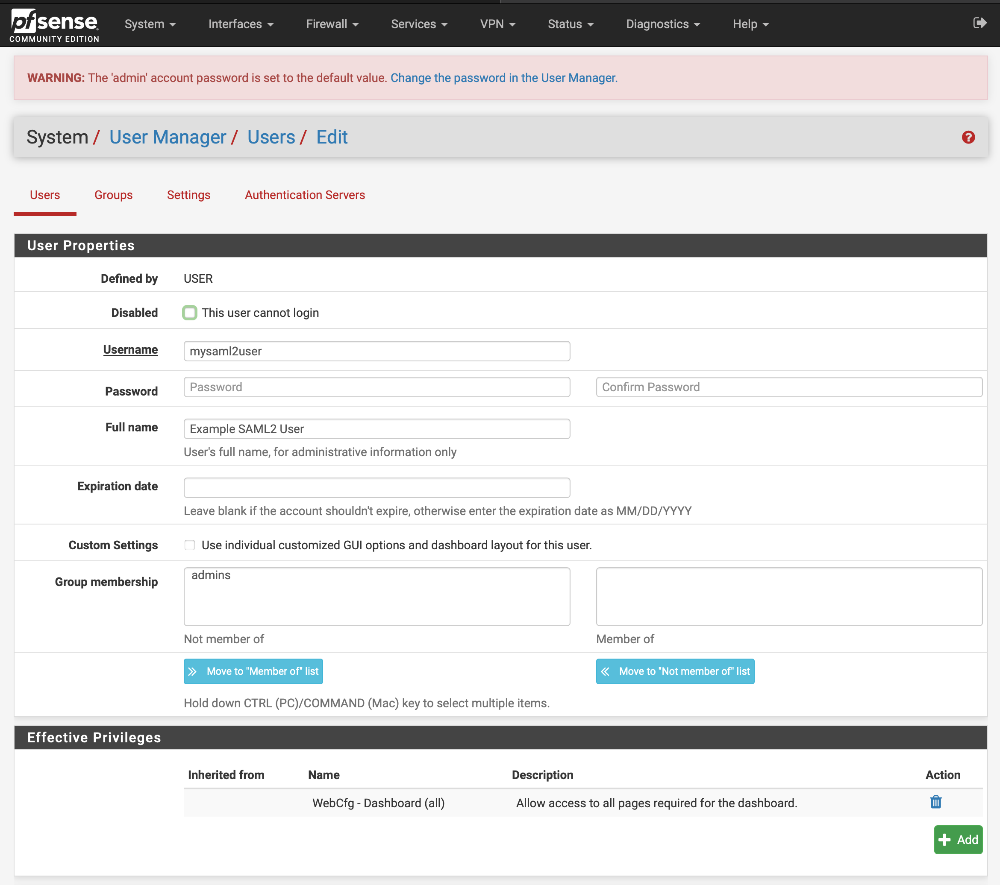

# pfSense SAML2 Authentication
`pfsense-saml2-auth` is a packaged SAML2 authentication extension for the pfSense webConfigurator. Currently, pfSense 
only supports local, LDAP and RADIUS authentication and does not support any native multi-factor authentication (MFA). 
At this time, there is unfortunately no roadmap for native SAML2 authentication or native MFA options on pfSense. With 
[pfSense Plus](https://www.netgate.com/blog/pfsense-plus-21-02-release-and-pfsense-ce-2-5-0-release-now-available.html)
being officially announced, it is unlikely we will see enterprise level features like SAML2 implemented in pfSense CE
anytime soon. This can create major headaches when dealing with security compliance standards such as PCI DSS that may 
require MFA on firewall admin logins. `pfsense-saml2-auth` helps alleviate this problem by allowing you to integrate 
single sign-on (SSO) with an identity provider such as Okta or OneLogin. In doing so, you will be able use the identity 
provider's built-in MFA for pfSense logins and greatly simplify user onboarding.<br><br>


<sub>The 'Login with SSO' option will only appear on the login screen after the package is installed and configured. SAML2
must be enabled in System > SAML2 for this option to appear.</sub><br>


## Key Features
- Easily integrates SSO logins for pfSense without losing any existing authentication functionality.
- Automatically maps groups returned within the SAML2 assertion to groups within pfSense to inherit existing privileges.
No need to create locate users before authenticating.
- Retains pfSense's built-in authentication and change logs.
- Adds the System > SAML2 settings page within the webConfigurator to make setup a breeze. 

## Installation 
To install, simply run the following command from the pfSense command line:<br>
```pkg add https://github.com/jaredhendrickson13/pfsense-saml2-auth/releases/latest/download/pfSense-2.5-pkg-saml2-auth.txz```

To uninstall:<br>
```pkg delete pfSense-pkg-saml2-auth```

_Note: when pfSense updates this package will be uninstalled. After updating pfSense, the package will need to be 
reinstalled to match the updated version_

## Supported Versions
Currently, the package fully supports the following pfSense versions including patched versions of the same release:
- pfSense 2.5.2-RELEASE
- pfSense 2.5.1-RELEASE
- pfSense 2.5.0-RELEASE
- pfSense 2.4.5-RELEASE
- pfSense 2.4.4-RELEASE

Any version not listed is technically unsupported, but may still function. Proceed with caution.

## Setup
After installation, navigate to System > SAML2 to configure SAML authentication. You will need to obtain a few
items from your IdP to add on this page and you will also need to provide a few items to your IdP from this page.
<br>



_Note: users must hold the `page-all` and/or `page-system-saml2-auth` privilege to access the System > SAML2 page._

### Privilege Mapping
There are two ways to map pfSense privileges to SAML2 users. Choose the method that bests suits your identity provider's
capabilities and your specific needs:

1) Create pfSense groups to match those that exist within your identity provider. For example,
if you have a group within your identity provider named `Network Admins` that you would like to grant pfSense access to,
you would need to create a group within pfSense named `Network Admins` exactly as it appears in your IdP. Ensure this
group's `Scope` value is set to `Remote` within pfSense. Then assign the desired pfSense privileges to the group. Please
note you must configure your IdP to return a group attribute within the SAML assertion that contains a list of groups
the authenticating user belongs to. You can specify the name of the group mapping attribute in System > SAML2 > Identity
Provider Groups Attribute. If your IdP does not return group attributes in the SAML assertion, this method cannot be 
used.
<br><br>

2) Create a local user that matches the authenticating user's username as it appears in your
IdP. You may use a random password for this user to prevent local authentication if needed. After the local user is 
created, assign any permissions you would like the user to obtain upon login. Once the user has been created and any
privileges have been assigned, the user will automatically inherit the assigned privileges upon SAML2 logins. Note,
pfSense does not allow emails as local usernames. In the case that your IdP uses email addresses as usernames by 
default, you may check the checkbox at System > SAML2 > Filter Email Usernames to only use the username before the @ 
symbol.
<br><br>

## Limitations
- This package is only intended to add SAML2 authentication to the webConfigurator. SAML2 authentication is not made
available for other pfSense services such as SSH, captive portal, OpenVPN, etc.

## Disclaimers
- This project is in no way affiliated with the pfSense project or it's parent organization Netgate. Any use of the 
pfSense name is intended to relate the project to it's developed platform and in no way capitalizes on the 
pfSense trademark. By using this software, you acknowledge that no entity can provide support or guarantee 
functionality. 
- This project was written and tested using Okta as the IdP. While it should support any IdP that supports SAML2 
applications, it cannot be guaranteed to work with your specific IdP.
- While extra precautions are taken to keep this package secure, you should always test thoroughly before implementing 
in a production environment. Use this software is at your own risk!
- This package was designed to be a simple, secure, and stable SAML2 implementation for pfSense. Because of this, 
additional features are unlikely to be added unless there are changes to the SAML standard itself. The package will 
continue to receive updates to address security issues and general bugs, as well as changes to accommodate future
versions of pfSense.
